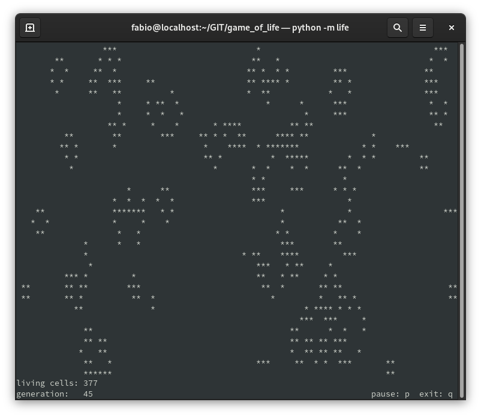

# Game of Life  

Conway's Game of Life implemented in Python 3 with curses library.  
This is a simple implementation not intended to be particularly fast or efficient.  
It starts from a random initial state.  
Type `python -m life` to run.  

